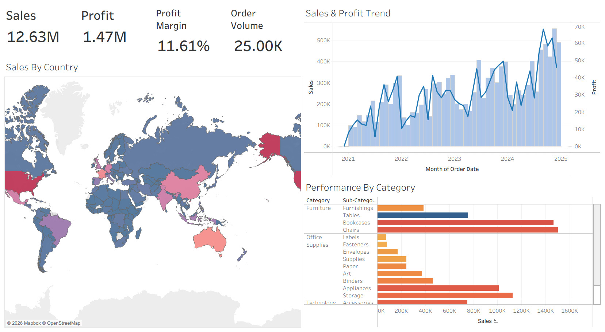
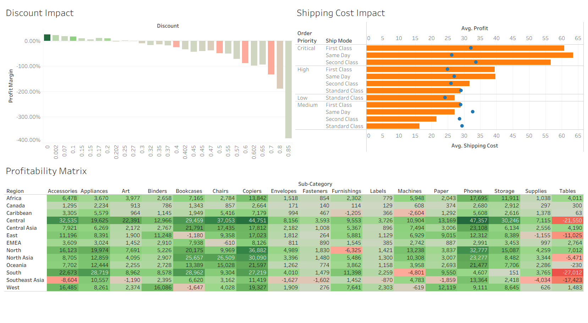
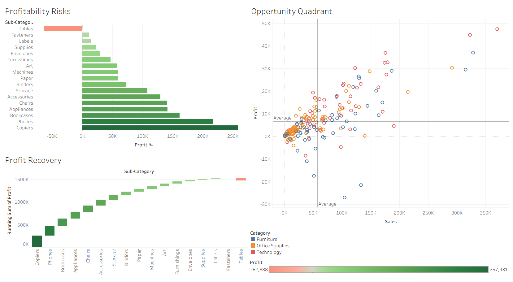

# 📊 Global Superstore: Business Performance Analysis (Tableau)

A five-dashboard interactive Tableau story mining a global retail sales dataset for the drivers behind a widening **sales-vs-profit gap** — built for a senior-management audience, with an accompanying strategic report.

> 📄 **Full write-up:** [`report/Business_Performance_Analysis_Report.md`](report/Business_Performance_Analysis_Report.md)
> 📈 **Tableau workbook:** `230722765.twbx` (open with [Tableau Desktop](https://www.tableau.com/products/desktop) or [Tableau Reader](https://www.tableau.com/products/reader))

  

---

## Overview

Using a global retail "Superstore"-style dataset (**~51,000 order-line records** spanning multiple markets, segments, and product categories), this project builds a five-part Tableau story that walks senior management through overall performance, customer risk concentration, unit economics, marketing efficiency, and forward-looking opportunities — closing with a set of concrete, prioritised recommendations.

**Headline finding:** the business is growing sales but not profit in step — driven by undisciplined discounting (breakeven collapses above ~20%), costly expedited shipping that isn't priced into the customer bill, and a small number of "bleeding" product/region combinations (most notably **Tables** in the **South** region).

---

## Repository Structure

```
.
├── README.md
├── 230722765.twbx                                    ← Tableau packaged workbook (place here)
└── report/
    ├── Business_Performance_Analysis_Report.md       ← full formatted write-up
    └── assets/                                       ← dashboard preview thumbnails
```

> ⚠️ The preview thumbnails in `report/assets/` are the low-resolution (192×192) cache images Tableau embeds in the workbook file itself — good enough to identify each dashboard at a glance, but not a substitute for opening the actual `.twbx`. For a crisper README, consider exporting full-resolution images per dashboard (**Dashboard → Export Image...** in Tableau) and swapping them in.

---

## The Story: Five Dashboards

| # | Dashboard | Focus |
|---|---|---|
| 1 | **Overall Business Performance** | Global sales/profit KPIs, geographic footprint, category-level profit vs. volume |
| 2 | **Customer Analytics** | Segment mix, top-customer concentration risk, profitable vs. loss-making accounts |
| 3 | **Sales & Profitability Drivers** | Discount-vs-margin relationship, region × sub-category profitability matrix, shipping cost economics |
| 4 | **Marketing & Promotional Efficiency** | Seasonality, discount-discipline (or lack thereof), shipping-mode preference |
| 5 | **Strategic Risks & Opportunities** | Opportunity quadrant (stars vs. laggards), bleeding sub-categories, profit-recovery waterfall |

---

## Key Findings & Recommendations

1. **Enforce a strict discount ceiling** — profitability collapses above ~20% discount, especially in the Corporate segment and Furniture (Tables) category.
2. **Overhaul fulfilment pricing** — expedited shipping costs are not being recovered from customers; raise the free-shipping order threshold or standardise on Standard Class.
3. **Sunset or reprice bleeding categories** — Tables in the South region is the single largest drag on the profit pool.
4. **Align marketing spend with seasonality** — concentrate promotional spend ahead of the Nov/Dec demand peak, and shift messaging from discounts toward value-adds.

Full supporting evidence, dashboard-by-dashboard, is in the [full report](report/Business_Performance_Analysis_Report.md).

---

## Dataset

- **Type:** Global retail "Superstore"-style order-line dataset
- **Size:** ~51,000 rows
- **Key fields:** Order/Ship Date, Ship Mode, Customer, Segment, Market, Region, Category, Sub-Category, Sales, Quantity, Discount, Profit, Shipping Cost, Order Priority

---

## Tech Stack

- **Visualization & analysis:** Tableau Desktop
- **Report:** Markdown / Word

---

## Opening the Workbook

1. Install [Tableau Desktop](https://www.tableau.com/products/desktop) (or the free [Tableau Reader](https://www.tableau.com/products/reader) for view-only access).
2. Open `230722765.twbx` — the packaged workbook bundles the dataset, so no separate data connection is required.
3. Navigate the **Story** tab at the top to step through all five dashboards in sequence.

---

## Course Context

Completed as a data visualisation / business intelligence coursework project (dataset reference: `ST2187_coursework_dataset`), submitted as a Tableau story with an accompanying strategic report for a simulated senior-management audience.

*Author: Kennith Vazhappilly Babu*
